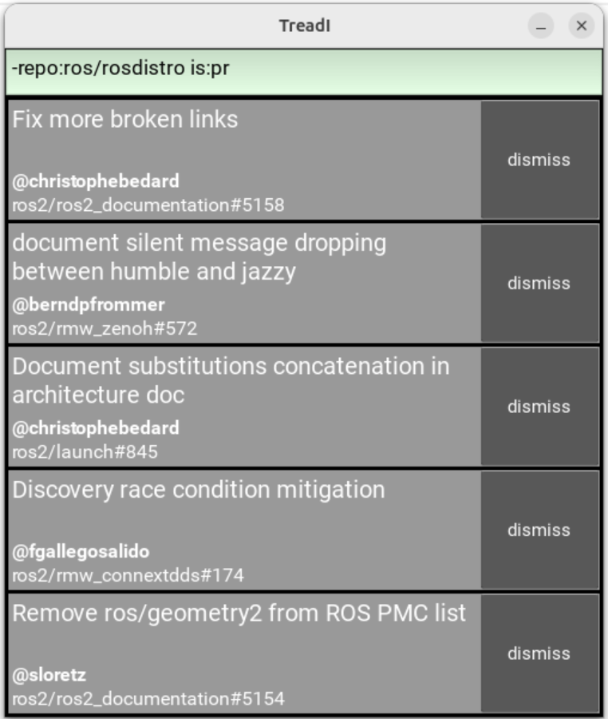

# TreadI (Treading Issues)

Drowning in Github issues and pull requests?
TreadI helps you keep your head above water!



TreadI displays the 5 most recently updated issues and PRs from any number of repos.

Click an issue or PR to open it in your web browser.
Click **dismiss** when you've handled it.
Dismissed issues and PRs won't show up again until something new happens to them.

## Filter syntax

Want to narrow your focus?
Filter issues and PRs with a subset of the familiar [Github search syntax](https://docs.github.com/en/search-github/searching-on-github/searching-issues-and-pull-requests).

* `author:USERNAME` - Show issues and PRs opened by a user
* `is:issue` - Show only Issues
* `is:issue` - Show only PRs
* `repo:owner/name` - Show only things from the repo `owner/name`
* `type:issue` - Same as `is:issue`
* `type:pr` - Same as `is:pr`

Invert filters by prepending `-`.

**Example:** Show PRs from `sloretz` that are not in `ros/rosdistro`

```
is:pr author:sloretz -repo:ros/rosdistro
```