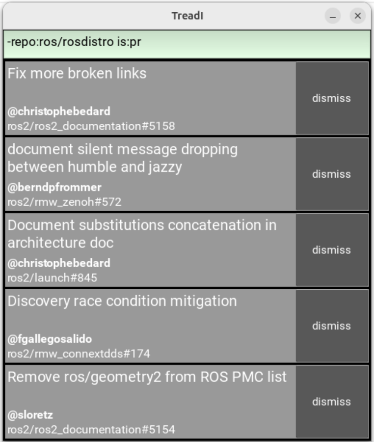

# TreadI (Treading Issues)

Drowning in Github issues and pull requests?
TreadI helps you keep your head above water!

TreadI displays the 5 most recently updated issues and PRs many repositories - even hundreds of repositories!

Filter issues and PRs with a subset of the familiar [Github search syntax](https://docs.github.com/en/search-github/searching-on-github/searching-issues-and-pull-requests).

Read [TreadI's documentation](https://sloretz.github.io/TreadI) to learn more.